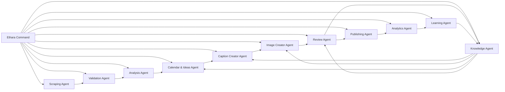

<!-- GENERATED FROM shared/agent-registry.ts BY scripts/build-specs.ts — DO NOT EDIT BY HAND -->

# Architecture

12 agents across 7 stages, 91 skills and 230 declared settings. Ethara acts through 36 tools (17 safe, 17 mutating, 2 irreversible).

## Stages

### Command (`command`)

The operator speaks; Ethara plans, confirms, dispatches and narrates.

- **Ethara Command** (`assistant`) — The command plane

### Discover (`discover`)

Scrape LinkedIn for movement across the keyword set.

- **Scraping Agent** (`scraping`) — Signal capture from LinkedIn

### Assess (`assess`)

Decide what is genuinely trending, and turn it into ranked opportunities.

- **Validation Agent** (`validation`) — Verdicts on every candidate
- **Analysis Agent** (`analysis`) — Opportunities and the consolidated hashtag set

### Plan (`plan`)

Form ideas and place them on the week.

- **Calendar & Ideas Agent** (`calendar`) — The weekly plan

### Create (`create`)

Write the copy, render the creative, apply human edits.

- **Caption Creator Agent** (`caption`) — Platform copy, grounded in the Knowledge Base
- **Image Creator Agent** (`image`) — The shipping creative
- **Review Agent** (`review`) — Human edits and compliance

### Ship (`ship`)

Validate the format, dispatch to the platform, record the receipt.

- **Publishing Agent** (`publishing`) — The one irreversible act

### Learn (`learn`)

Measure against our own baseline, research the web, write the lesson back.

- **Knowledge Agent** (`knowledge`) — The cited Knowledge Base
- **Analytics Agent** (`analytics`) — Measurement against our own baseline
- **Learning Agent** (`learning`) — Turning outcomes into durable knowledge

## The hand-off graph

> The Orchestration screen draws its edges from `handsOffTo` directly, so this picture **is** the spec. If the order is wrong, fix the graph — never special-case the orchestrator.
